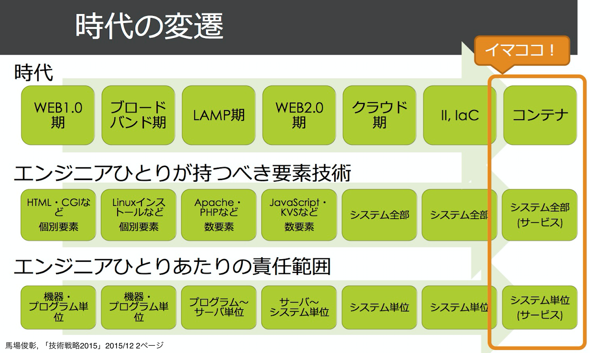
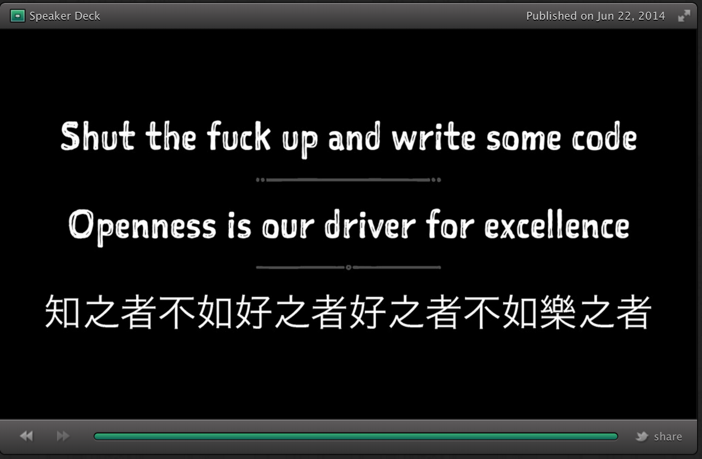

footer: July Tech Festa 2016 2016/07/24 - Yoshikawa Ryota ( @rrreeeyyy ) / Topotal
slidenumbers: true
autoscale: true
theme: Plain Jane

# **今あえて試行錯誤しながら   "車輪の再発明"をする意味**

---

---

# 車輪の再発明 (reinventing the wheel)

> 車輪を題材にした慣用句であり、
> 世界中で使われている。
> 広く受け入れられ確立されている
> 技術や解決法を知らずに
> （または意図的に無視して）、
> 同様のものを再び一から作ること
-- https://ja.wikipedia.org/wiki/車輪の再発明

---

# 車輪の再発明好きな人？

---

# 車輪の再発明嫌いな人？

---

# なぜいま車輪の再発明なのか？

---

# 背景

1. **インフラエンジニアはプロトコル・低レイヤの知識を持つ必要がある**
    - Infrastructure Complexity
        - 加えて、日夜新しい概念・プロダクトなどが登場する
2. **インフラエンジニアはコードが書ける必要がある**
    - Infrastructure as code
        - インフラのコード化
    - Site Reliability Engineer
        - プロダクト自体のコードレビューなども責務としている

---

 

---

# なぜいま車輪の再発明なのか？

1. **プロトコル・低レイヤの理解が深まる**
   - → コード化・複雑化が進む昨今で非常に良い勉強法となる
2. **コーディングの良い練習になる**
   - → ソース・仕様を読み手を動かして実装までするので非常に練習になる
3. **代表的プロダクトを作れる可能性がある**
    - → 再発明したものにアイデアを加える事で発明になりえる

→  **複雑化・コード化が進む昨今、インフラエンジニアにオススメの勉強法だと考える**

---

# Shut the fuck up and write some code? [^1]
 

[^1]: https://speakerdeck.com/mizzy/serverspec-at-jtf2014?slide=75

---

# ... but How?

---

## Lv1. 写経
## Lv2. 車輪の再発明
## Lv3. 代表的プロダクト

---

# Lv1. 写経

- 多くの人はここからスタート
    - 新しくプログラミングを始めるとき
    - 新しいプログラミング言語を覚えるとき
- 写経もある意味では車輪の再発明
- 方法論・書籍ともに充実していて多くの人は実践できる

---

# 写経のその後...

- 作りたいものがある？素晴らしいアイデアがある？
    - → ぜひ作りましょう！
        - → でも多くの人はこうではない
- よく聞く言葉
    - → 「何も作りたいものがない...」
        - **→ 車輪の再発明を試してみる**

---

# Lv2. 車輪の再発明

---

# Lv2. 車輪の再発明

- プログラミングのやり方が何となく分かってきた頃から
- **自分の勉強したいプロトコル・アルゴリズムを実装する**
    - プロトコル・アルゴリズムの勉強にもなり一石二鳥
- **自分の使っているプロダクトに似ているものを作ってみる**
    - どういう実装なのか？どこがボトルネックになりそうなのか？
        - なんとなく想像できるようになる
        - 実際に見てみるとすごいコードが書いてあって勉強になる

---

## EX1. HTTP サーバの自作

- HTTP プロトコルを喋る TCP サーバを自作してみる
- 基本である HTTP プロトコルをしっかり理解できる
    - HTTP とはどういうプロトコルなのか？
    - どういうヘッダがありどういう役目があるのか？
- Apache, Nginx 等の HTTP サーバの基本的な動きも分かるようになる
    - Apache と Nginx ではどういう違いがあり何に差がでるのか？なども

---

## EX1. HTTP サーバの自作

- **難しいかと思いきや動かすだけなら意外と簡単**
    - 言語にもよるが 100 行程度あればブラウザから見れるサーバが作れる
    - 実装する言語は最初は慣れてる言語・勉強したい言語で良い
- しっかり実装しようと思うと更に色々な事が学べる
    - I/O (C10K 問題): `select()`, `epoll()` などについての知識
    - 各種ヘッダの詳細な動き: Keep-Alive, Range, Cache-Control ...
    - CGI 動作の仕組み: CGI はどのようにして動作しているのか？

---

## EX1. HTTP サーバの自作

- **HTTP は広く使われているので本当に正しく理解できていると便利**
    - 意外とどういうプロトコル・実装になっているのか分からない人は多い
- 自分で作った HTTP サーバでブラウザから HTML が見れると感動
- **インフラエンジニアだけでなくアプリエンジニアにもオススメ**
    - パフォーマンスを意識したコード・HTTP のデバッグなどに非常に役立つ
- 最近本が出ていたので参考にすると良さそう
    - `『Webサーバを作りながら学ぶ 基礎からのWebアプリケーション開発入門』` [^2]

[^2]: http://d.hatena.ne.jp/kmaebashi/20160605/p1

---

## EX2. Linux コンテナエンジンの自作

- Linux のコンテナエンジンを自作してみる
- Docker などでコンテナ技術が一般化してきた
    - Docker は非常に巨大なので動きが分かりづらいことも多い
- 実装することで中でどのような動きになっているか理解できる
    - `cgroup` や `chroot`, `veth` のような技術も理解できる

---

## EX2. Linux コンテナエンジンの自作

- これも難しいかと思いきや動かすだけなら意外と簡単
    - https://github.com/kazuho/jailing は 200 行程度の Perl スクリプト
- Linux コンテナ自体は大体 10 年前ぐらいからある
    - 実装してみると Docker は何が特別だったのかも分かる
        - 逆に Docker は何を犠牲にしたのかも分かる
- コンテナエンジンの自作をしている人は結構いるので参考にすると良さそう
    - https://github.com/yuuki/droot や https://github.com/haconiwa など

---

## その他の例

- 言語処理系を作ってみる
- プロビジョニングツールを作ってみる
- ログイン認証サーバを作ってみる
- 監視サーバを作ってみる
- 分散システムのアルゴリズムを実装してみる
- ...

---

## 車輪の再発明で得られる物

- **プロトコル・低レイヤなどの普遍的で長く使える技術を効率よく学べる**
- **似たものを作るので元のソースコードを必然的に読むことが増える**
    - 他者のソースコードを大量に読むことはプログラミング上達の方法の一つ
    - Apache, Nginx, Docker(libcontainer) 等のソースに慣れる事が出来る
        - **何かトラブルがあった時にソースコードレベルで動作を追える**
- **RFC などのしっかりした仕様を元にソースを書く経験が出来る**
    - 新しい仕様が公開された時などに RFC を読み解く練習にもなる

---

# Lv3: 代表的プロダクト

---

# 代表的プロダクト [^3]

> 「エンジニアであれば誰でもそうであるように」といえることなのかどうかはわからないが、「○○さんといえば□□で有名」といわれるような、ここでいう「代表的プロダクト」を持つことは、少なくとも僕にとっては憧れるところの大きいものだ。
> 「代表的プロダクト」と呼ばれるにはどういった条件が必要なのだろうか。以下の4つぐらいがすぐに思い浮かぶ。それなりの規模のもの、広く使われるもの、技術的新規性のあるもの、作者個人を強く想起させるもの。上記4つを必ずしもすべて満たしている必要はないかもしれないが、満たしている方がより「代表性」が高かろうことが想像できる。

[^3]: http://kentaro.tumblr.com/post/66674445339/代表的プロダクトについて

---

## 車輪の再発明 + アイデア = 代表的プロダクト?

- **車輪の再発明は自身のアイデアを加える事で発明たりえる**
- 作ったソフトウェアに元のソフトウェアとの差分を加える
    - ex. 既存のソフトウェアの不満点を解決している
    - ex. デプロイや運用が既存のソフトウェアより簡単になっている
- **加えるべきアイデアは作っているうちに見えてくることも多い**
    - 車輪の再発明をしているうちに対象ドメインの深い知識が得られるため

---

## 車輪の再発明 + アイデアの例

- **抽象化しすぎず特定の規模・ドメインを対象に特化してみる**
    - 自分の組織の規模に必要な分だけ抽象化するようにする
- **書き直すなら "どの言語で書き直すのか？" は結構重要**
    - 言語の特性ごとに向いてる・向いていないがある
        - ワンバイナリでデプロイしたい？DSL を作りたい？
- **ユーザインタフェースの考え方も結構重要**
    - どういう設定ファイルにするか？想定運用フローはどうするか？

---

## 車輪の再発明 + アイデアの例

- Linux コンテナエンジンは複雑すぎることが多い
    - 自分の組織の規模に最適化した部分のみを実装する方針 [^4]
- 既存のツールを Go 言語で書き直す
    - ワンバイナリで動くのでクライアントツールなら導入障壁が下がる
    - 並列処理が実装しやすいので速度面での利点も得られる可能性がある
- 設定ファイルや自動化が難しいツールを CRuby/mruby などの言語で実装してみる
    - DSL も作りやすく Web エンジニアもよく使う言語なので受け入れられやすくなる

[^4]: http://blog.yuuk.io/entry/diy-container

---

## 発明アンチパターン(嫌われる車輪の再発明)の例

- **既存の物の劣化品を作ってプロダクションに入れてしまう**
    - プロダクションに入れるなら既存の物との差は何か？をちゃんと意識する
        - ちゃんと説明出来るようにしておく
        - ドキュメントなどでちゃんと残すようにしておく
- **既存の物の修正で十分済むのに新しい物を作って導入してしまう**
    - 導入済みのもので修正で済むなら修正しましょう
- **→ 自分の発明にするには作ろうとしている対象領域の深い知見が必要**

^ この辺りの舵取りは結構難しいと思う
^ どのタイミングで修正 →  再発明に切り替えるか？
^ 単純に既存のソフトウェアの不満な点 + 移行コスト < 利点 という考え方もある

---

# まとめ

- **コーディングの練習の手段として車輪の再発明を紹介**
    - 低レイヤ・プロトコルの理解・プログラミングの良い練習になる
- **車輪の再発明から学べる事について例を交えて紹介**
    - 低レイヤ・プロトコルなどへの深い理解
    - 仕様や実際の挙動から実装まで落とし込める実装力
- **自分のドメインでの知識・経験を加える事で代表的プロダクトにもなりえる**
- **ぜひ JTF2016 のテーマである "やってみた" 側になってみてください**
    - Shut the fuck up and write some code!

---

# Any questions?

---

# 参考資料

- `https://speakerdeck.com/mizzy/serverspec-at-jtf2014`
- `http://d.hatena.ne.jp/kmaebashi/20160605/p1`
- `https://github.com/kazuho/jailing`
- `https://github.com/yuuki/droot`
- `https://github.com/haconiwa/haconiwa`
- `http://blog.yuuk.io/entry/diy-container`
- `http://kentaro.tumblr.com/post/66674445339/代表的プロダクトについて`
- `https://github.com/peco/peco`

---

# 質疑応答用スライド

---

# モチベーションの維持

- 車輪の再発明ではモチベーションが続かない？
    - モチベーションの維持は人それぞれやり方が違う
- ものを作って動かすこと自体に楽しみを感じる人
    - 車輪の再発明は結構向いてるかも？
- 代表的プロダクトを作ることに夢を感じる人
    - 車輪の再発明は結構向いてるかも？
        - 自分のした経験・持ってる知識を反映できるか次第

---

# 作らなくても分かるという人はどうすれば？

- もちろんその通り
    - 全ての勉強したいことを再実装していたら時間が足りない
- 自分の 1 つの特化したい事項ぐらいは実装を経験しておくべき
    - 作ることで初めて分かってくる事もあると思っている
- 使う側から作る側への転換も将来的には求められると思っている
- 作らなくても分かるぐらい賢い人はどんどん作って公開してください

---

# 低レイヤ・プロトコルの知識はなぜ重要か？

- いわゆるツールというものは移り変わりが激しい
    - ツールの使い方だけ追っていくと本質を理解する前に時間切れになる
    - とはいえ基本的なところは同じ(例. HTTP プロトコル)
- プロトコルや低レイヤの知識は普遍的に長く使える
    - 低レイヤのシステムコールなどは大きく変化することは少ない
    - プロトコルは漸進的に進化することもある
        - HTTP 1.0 -> HTTP 1.1 -> HTTP 2.0
        - プロトコルの使用を読む力・読んで実装する力はいつでも必要

---

# 車輪の再発明の時間管理について

- Q.
    - 再開発しようとするとずっと出来る
        - HTTP プロトコル全部実装しきるまで...
- A.
    - スモールゴールを決める
        - HTTP サーバであれば一旦ブラウザで見れるまで
    - どんどん要件を増やしていくのは結構面白い
        - つぎはこのヘッダ...このヘッダ
    - 勉強したい領域によって実装を増やしていけば良い

---

# どうやって仕事に入れるか

- Q.
    - いざプロダクションに入れるときどう入れていくか？
- A.
    - 組織・チームの合意を取ってから仕事に入れていく
        - 全く関係ない勉強のコードを仕事でずっと書くのは変
    - こういう技術が必要で勉強する必要がある
    - こういうツールを使って既存よりこう良いので仕事で書きたい
        - これが組織・チームで合意出来て初めて仕事で出来ると思う
        - 勉強や実績などにとらわれないで出来る組織だといいですね
